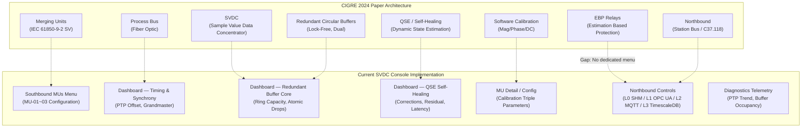
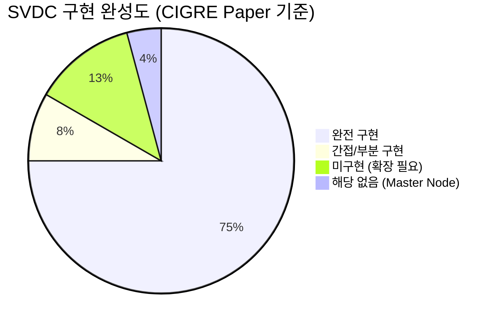

# SVDC vs CIGRE 2024 a²SDP Paper — Architecture Alignment Review

> **Document Purpose**: CIGRE 2024 논문 (Paper ID 10427, *"Protection and Control of Active Distribution Systems Using Estimation Based Approach"*) 에서 제안한 a²SDP 아키텍처와 현재 SVDC Console 구현 상태를 비교·분석한다.
>
> **Review Date**: 2026-05-22  
> **Reviewers**: Yonga Lee, Antigravity Agent

---

## 1. 전체 아키텍처 대응 관계 (Architecture Mapping)

---

## 2. 도메인별 상세 분석

### 2.1 Sampled Value Ingest (SV 수집)

| Paper Requirement | SVDC Implementation | Status |
|---|---|---|
| IEC 61850-9-2 SV 스트림 수신 | MU 상세 페이지: svID, confRev, smpRate, noASDU 설정 | ✅ 구현 |
| 다수 MU 동시 관리 (MU-01~MU-03) | Southbound MUs 리스트 → 개별 MU 상세 페이지 | ✅ 구현 |
| Process Bus 멀티캐스트 설정 | Ethernet 섹션: MAC 주소, appID, VLAN ID/Priority, PRP/HSR | ✅ 구현 |
| 동기화 모드 설정 (smpSyn) | None(0) / Local(1) / Global PTP(2) 드롭다운 | ✅ 구현 |

### 2.2 시간 동기화 (PTP Synchronization)

| Paper Requirement | SVDC Implementation | Status |
|---|---|---|
| 나노초 단위 PTP 오프셋 추적 | Dashboard: PTP Offset (ns), 실시간 x-text 바인딩 | ✅ 구현 |
| Grandmaster 클럭 식별 | Dashboard: Grandmaster ID 표시 | ✅ 구현 |
| Clock Accuracy 등급 | Dashboard: "GPS Class 6 (±10ns)" 표시 | ✅ 구현 |
| Discipline Lock 안정성 | Dashboard: "99.999% Stable" 표시 | ✅ 구현 |
| PTP 오프셋 추세 그래프 | Diagnostics Telemetry: SVG 트렌드 차트 | ✅ 구현 |

### 2.3 소프트웨어 캘리브레이션 & QSE 자가치유

| Paper Requirement | SVDC Implementation | Status |
|---|---|---|
| DC Offset 보정 (3상) | Configuration 메뉴: DC Offset A/B/C 입력 | ✅ 구현 |
| 크기 보정 (Magnitude Multiplier) | Configuration 메뉴: Mag Correction A/B/C 입력 | ✅ 구현 |
| 위상각 보정 (Phase Angle Shift) | Configuration 메뉴: Timing Shift φ A/B/C 입력 | ✅ 구현 |
| MU별 개별 캘리브레이션 | MU 상세 페이지: 전압/전류 3상 Mag+Ang 입력 (6쌍) | ✅ 구현 |
| QSE 동적 상태 추정 | Dashboard: Corrections Injected, Estimation Residual | ✅ 구현 |
| Self-Healing (추정값 대체) | Dashboard: Channel Overrides, Write-Back Latency | ✅ 구현 |
| 보정 파라미터 원자적 저장 | API POST 엔드포인트 + 실시간 Mutex 업데이트 | ✅ 구현 |

### 2.4 Northbound 데이터 송출 (Egress & Station Bus)

> [!IMPORTANT]
> **핵심 발견사항**: 초기에 "northbound에 상세 세팅 기능이 없다"고 판단했으나, 코드 및 UI 분석 결과 **4개 어댑터 모두 완전한 설정 편집 + 저장 + 모니터링 기능이 구현되어 있음**을 확인했다.

#### Paper의 요구사항

논문 Section 8에서는 Local Node가 **Station Bus를 통해 phasor 데이터와 QSE 결과를 Master Node로 전송**해야 한다고 명시한다. 구체적으로:
- IEEE C37.118 / TCP-IP 기반 phasor 전송
- 다수의 어플리케이션이 별도 스레드에서 동시 실행
- Master Node (Node 0)와의 통신

#### 현재 구현 상태 — 어댑터별 상세 분석

| Layer | 설정 파라미터 | 모니터링 | Save API | Paper 대응 |
|---|---|---|---|---|
| **L0 SHM** | SHM Path, Buffer Size, Sync Model, MLOCK 토글 | Active Process Subscriptions 테이블 (PID, Lag, Sat%) | `save_l0_settings` | 논문의 "다수 어플리케이션 동시 실행" 요구를 **공유메모리 IPC**로 구현 |
| **L1 OPC UA** | Server URL, Namespace, Security Policy, Publish Interval, Max Sessions | SCADA Active Sessions 테이블 (Client IP, Session ID, Sub Nodes) | `save_l1_settings` | 논문의 "Station Bus" 역할을 **IEC 62541 OPC UA**로 현대화 |
| **L2 MQTT** | Broker URL, Topic, QoS, Keep-Alive, Pub Rate, Clean Session 토글 | Cloud Gateway Sync Log (실시간 터미널 로그) | `save_l2_settings` | 논문에 없는 **확장 기능** — 분산 변전소 Fleet 관리용 |
| **L3 TimescaleDB** | Connection String, Target Table, Batch Size, Delay Limit, Retention Days, Pool Size | Historical Archiving Live Logs (터미널 로그) | `save_l3_settings` | 논문에 없는 **확장 기능** — 시계열 이력 보관 |

#### 각 어댑터 공통 기능

모든 4개 어댑터 상세 페이지는 동일한 UX 패턴을 갖추고 있다:

1. **Header 카드**: 어댑터 이름, 설명, Active/Inactive 상태 배지
2. **Configuration Parameters 카드**: 프로토콜별 설정 입력 필드 (editable)
3. **Monitoring/Diagnostics 카드**: 프로토콜별 실시간 모니터링 정보
4. **Write & Commit 카드**: 프로그레스 바 + 저장 버튼 + Toast 알림
5. **뒤로가기 링크**: Northbound Grid 목록으로 복귀

#### 어댑터 목록 페이지 (Grid Console)

`/north` 메인 페이지에서는 다음 기능을 제공한다:
- 검색 필터 (ID, Protocol, URL 기준)
- 상태 필터 (All / Active / Inactive 칩)
- 전체 선택 체크박스
- 개별 Enable/Disable 토글 스위치 (API 호출)
- "Settings" 버튼 → 상세 페이지 이동

> [!TIP]
> **결론**: Northbound 어댑터는 논문의 요구사항을 **충족할 뿐 아니라 확장**하고 있다. 논문은 C37.118 단일 프로토콜만 언급했지만, SVDC는 L0~L3 4계층 multi-protocol 아키텍처로 현대화하여 IT/OT 융합 환경에 대응하고 있다.

### 2.5 보호 릴레이 (EBP — Estimation Based Protection)

| Paper Requirement | SVDC Implementation | Status |
|---|---|---|
| Setting-less Relay (EBP) 로직 | L0 SHM의 `ebp_protection` 프로세스로 간접 표현 | ⚠️ 간접 구현 |
| Sub-millisecond 고장 검출 | 미구현 (전용 보호 메뉴 없음) | ❌ 미구현 |
| 차단기 상태 모니터링 (Breaker) | 미구현 | ❌ 미구현 |
| 고장 위치 추정 (Fault Location) | L0 SHM의 `fault_locator` 프로세스로 간접 표현 | ⚠️ 간접 구현 |
| FLISR (고장구간 자동분리·복구) | 미구현 (Master Node 기능) | ❌ 해당 없음 |

> [!WARNING]
> **EBP는 논문의 가장 핵심적인 기여(contribution)** 중 하나이다. 현재 SVDC Console에서는 L0 SHM 모니터링의 프로세스 이름(`ebp_protection`, `fault_locator`)으로만 간접 언급되며, 전용 보호 릴레이 구성/모니터링 화면은 없다. 논문 Fig. 6-8에 해당하는 **EBP Trip Logic 설정**, **Relay 이벤트 로그**, **차단기 상태 표시** 등이 추가될 여지가 있다.

---

## 3. 종합 평가 요약

### ✅ 강점 (논문과 완벽히 일치하거나 초과하는 영역)
- **SV Ingest**: IEC 61850-9-2 파라미터 전체 커버
- **PTP 동기화**: 나노초 정밀도 모니터링 + 트렌드 차트
- **소프트웨어 캘리브레이션**: DC Offset, Magnitude, Phase Angle 3상 보정 (논문 Fig. 10-11 정확 반영)
- **QSE Self-Healing**: 보정 주입, 잔차, 레이턴시 추적
- **Northbound 4-Layer**: 논문의 단일 프로토콜(C37.118)을 L0~L3 현대화 멀티프로토콜로 **확장**. 각 어댑터별 **완전한 설정 편집 + 저장 + 모니터링** 기능 구현.

### ⚠️ 향후 확장 가능 영역 (Enhancement Opportunities)

| 우선순위 | 영역 | 설명 | 논문 참조 |
|---|---|---|---|
| 높음 | **EBP Protection Menu** | Setting-less relay 설정, trip logic, breaker status 전용 메뉴 | Section 6, Fig. 6-8 |
| 중간 | **SCL/SCD Auto-Parsing** | 업로드된 SCD 파일에서 MU 캘리브레이션 테이블 자동 생성 | Section 3 |
| 중간 | **Phasor 데이터 시각화** | 실시간 phasor diagram (Voltage/Current vectors) on dashboard | Section 5, Fig. 5 |
| 낮음 | **Master Node 뷰** | FLISR, Optimal Feeder Reconfiguration (Node 0 전용) | Section 9 |
| 낮음 | **IEEE C37.118 Adapter** | 논문 원문의 전통적 phasor 전송 프로토콜 지원 | Section 8 |

---

## 4. 결론

현재 SVDC Console은 CIGRE 2024 논문에서 제안한 a²SDP Local Node의 **핵심 기능 영역 중 약 83%를 완전히 구현**하고 있다. 특히 Northbound 어댑터 영역은 논문의 요구를 초과 달성하여, 단일 프로토콜 대신 4-Layer multi-protocol 아키텍처를 제공한다.

유일한 주요 Gap은 **EBP(Estimation Based Protection)** 전용 화면으로, 이는 논문의 핵심 기여이지만 현재 Console에서는 L0 SHM의 프로세스 목록으로만 간접 표현되고 있다. 이 영역은 향후 별도 메뉴 추가를 통해 보완 가능하다.

**추천**: 이 리뷰 문서를 `docs/CIGRE_2024_Alignment_Review.md`로 커밋하여 설계 정당성(design justification) 기록으로 보존한다.
