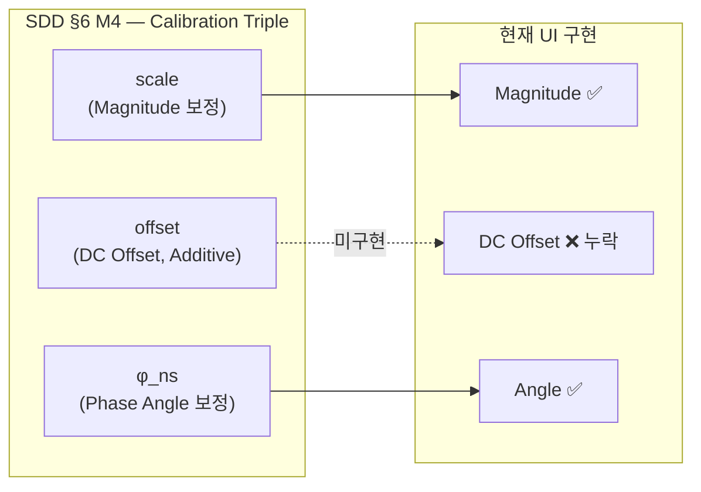

# Southbound (SV Ingest) 구현 상태 분석 보고서

> **분석 기준**: SDD v0.1 (FR-1~10, NFR-1~5, §5.1, §6, §7, §8.1) + IP v0.2 (WBS-2, WBS-4, WBS-5)
> **분석 대상**: [mus_list.rs](file:///c:/Users/yonga/TestWork/SVDC/crates/svdc-console/src/routes/mus_list.rs) (MU 리스트 + 상세 페이지)

---

## 1. 현재 구현 완료 항목 (22개) ✅

### MU 리스트 페이지 (`/south/mus`)
- MU ID, Status Badge, IP Address, MAC, Sample Rate, Dropped Count, Latency(RTT)
- 필터 (All/Healthy/Degraded/Disconnected), 검색, Bulk Ping, Bulk Calibrate

### MU 상세 페이지 (`/south/mus/:id`)

| 섹션 | 구현된 파라미터 | SDD 참조 |
|---|---|---|
| **1. IEC 61850 Ingestion** | svID, confRev, smpRate (4000/4800/12800), noASDU (1/2/8), smpSyn (0/1/2) | FR-7, WBS-2.2 |
| **2. Ethernet & VLAN** | Destination MAC, appID, VLAN ID(0-4095), VLAN Priority(0-7), PRP/HSR | WBS-4.1, §8.1 |
| **3. Calibration** | 전압 3상 + 전류 3상 × Magnitude + Angle (12개 입력) | FR-7, WBS-2.7 |
| **기타** | 전압 파형 시각화 (SVG), Write & Commit 버튼, Toast 알림 | — |

---

## 2. 누락 항목 — Critical (7개) 🔴

| # | 누락 항목 | SDD 근거 | 설명 |
|---|---|---|---|
| **1** | **DC Offset 보정값** | SDD §6 M4: `(scale, offset, φ)` triple | SDD는 캘리브레이션을 **3요소**(크기 보정, DC 오프셋, 위상각)로 정의하나, UI에는 Magnitude+Angle **2요소**만 존재. **DC Offset(additive) 누락** |
| **2** | **CT/PT 비율** | SDD §7.2: `ct_pt_ratio: f64` | 채널 레지스트리 필수 필드. 계기용 변압기 변환비 입력 없음 |
| **3** | **극성 (Polarity)** | SDD §7.2: `polarity: ±1` | 채널 레지스트리 필수 필드. 극성 반전 설정 없음 |
| **4** | **수신 지터 히스토그램** | FR-8, WBS-5.2 | MU별 도착 지터 분포 모니터링 필수이나 미구현 |
| **5** | **보간 샘플 카운터** | WBS-5.1: `samples_interpolated` | 목록에 "Dropped"만 있고 보간(interpolation) 처리 횟수 표시 없음 |
| **6** | **데이터 품질 플래그** | SDD §7.1: COMPLETE / INTERPOLATED / QSE_CORRECTED / DEGRADED | 프레임별 품질 상태 표시 없음 |
| **7** | **SV 디코드 오류 카운터** | WBS-2.2 | Malformed/Truncated/Oversized ASDU 등 파싱 오류 통계 없음 |

---

## 3. 누락 항목 — Medium/Low (8개) 🟡

| # | 누락 항목 | SDD 근거 | 우선순위 |
|---|---|---|---|
| 8 | PTP 동기화 상태 (MU별) | WBS-5.3 | Medium |
| 9 | 수신 샘플 총 카운터 | WBS-5.1: `samples_received` | Medium |
| 10 | QSE 보정 횟수 (채널별) | WBS-5.1: `samples_qse_corrected` | Medium |
| 11 | 마지막 수신 타임스탬프 | WBS-5.2 | Medium |
| 12 | 관측 vs 설정 샘플레이트 비교 | FR-8 | Medium |
| 13 | 전류 파형 시각화 | Calibration 검증 | Medium |
| 14 | SCD 소스 파일 정보 | FR-9 | Low |
| 15 | Neutral/Ground 채널 | SDD §7.2: phase enum (N, ground) | Low |

---

## 4. 캘리브레이션 모델 불일치 (핵심 이슈)

> [!IMPORTANT]
> SDD는 채널별 캘리브레이션을 `(scale, offset, φ)` **3-tuple**로 정의하지만, 현재 MU 상세 페이지는 `(Magnitude, Angle)` **2-tuple**만 제공한다. DC Offset 보정 입력 필드가 추가되어야 한다.
>
> 참고: `Configuration` 메뉴(`/config`)에는 DC Offset 입력이 있지만, 이것은 전역 설정이며 **MU별 개별** DC Offset은 MU 상세 페이지에 없다.

---

## 5. 추천 조치

### 즉시 추가 권장 (논문/SDD 정합성)
1. MU 상세 페이지 캘리브레이션 섹션에 **DC Offset 입력 필드** 추가 (6개: Va~Ic)
2. MU 상세 페이지에 **CT/PT Ratio** + **Polarity** 입력 필드 추가

### 추후 확장 권장 (운영 모니터링)
3. MU 상세 페이지에 **Health Diagnostics** 카드 추가:
   - 수신/누락/보간/QSE보정 샘플 카운터
   - 데이터 품질 플래그 실시간 표시
   - SV 디코드 오류 카운터
   - 수신 지터 히스토그램 (SVG 차트)
